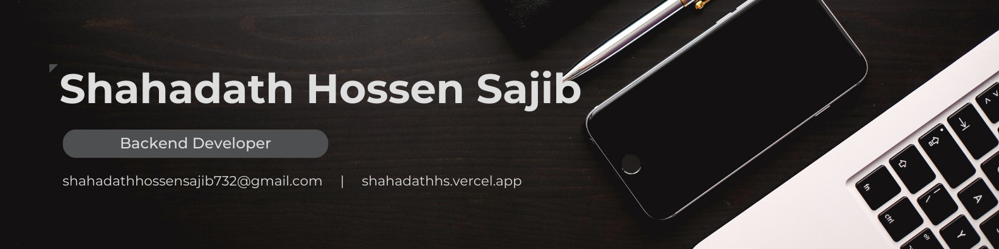

<!--

**Backend Developer · DevOps · Node.js · NestJS**
-->

---

# 👋 Hi, I'm Shahadath Hossen Sajib (Sajib)

Backend Developer specializing in **Node.js, NestJS, and Express.js**, focused on building **scalable, secure, and production-ready backend systems**.  
I enjoy designing robust APIs, working with databases, and solving real-world engineering problems.

---

## 🚀 About Me

- 🧠 Strong in backend architecture, API design, and system scalability
- 🛠️ Experienced with **PostgreSQL, MongoDB, Redis**
- ⚡ Built real-time systems using **Socket.IO**
- 🐳 Hands-on with **Docker, CI/CD**, and **AWS (EC2 & S3)**
- 🌱 Currently learning **Golang**, **C++**, and **Data Structures & Algorithms**
- 🤝 Open to collaboration and backend-focused opportunities

---

## ✍️ Writing & Knowledge Sharing

- 📝 **Medium**: https://medium.com/@shahadathhs  
- 📰 **Substack**: https://substack.com/@shahadathhs  

I write about backend engineering, system design, DevOps, and real-world project learnings.

---

## 🔗 Connect With Me

---

## 📫 Contact

- 📧 Email: **shahadathhossensajib732@gmail.com**
- 📄 Resume: https://drive.google.com/file/d/1E8-4vCZD0VW1QflvoRHTAJBedZRtUJ3f/view

---

## 💡 Philosophy

> *"Clean architecture, clear intent, and systems that scale."*

---

### 🛠️ Tech Stack

| Category           | Tools & Technologies                                                                                                                                                                                                                                                                                                                                                                                                                                                                                                                            |
| :----------------- | :---------------------------------------------------------------------------------------------------------------------------------------------------------------------------------------------------------------------------------------------------------------------------------------------------------------------------------------------------------------------------------------------------------------------------------------------------------------------------------------------------------------------------------------------- |
| **Backend**        |                                                                                                          |
| **Databases**      |      |
| **Real-time**      |                                                                                                                                                                                                                        |
| **Cloud & DevOps** |                |

---

### 💼 Experience

**Backend Developer — Softvence Agency** _(July 2025–Present)_

- Building and maintaining scalable RESTful APIs using **NestJS** and **TypeScript**.
- Built WebSocket gateways and background workers using **BullMQ**.
- Designing and managed relational schemas in **PostgreSQL** with **Prisma**.
- Designing and maintained **subscription flows** with **Stripe**.
- Deployed scalable architectures to **AWS EC2 & S3** with Docker and CI/CD (GitHub Actions).

**Web Developer — Monster Studio** _(Oct 2024–Apr 2025)_

- Contributed to a large-scale **MERN stack** project with frontend and backend features.
- Built reusable components and REST APIs using **React.js**, **Remix**, **Express.js**, **Node.js**, and **MongoDB**.
- Managed **Nx monorepo** for modular, scalable development.
- Led a small frontend team, improving collaboration and productivity.

**Quality Assurance Intern — Monster Studio** _(Aug 2024–Sep 2024)_

- Wrote unit/integration tests using **Jest**, **Vitest**, **MSW** & **Supertest**; performed load testing with **K6**.
- Helped improve code quality and reliability in a full-stack testing setup.

---

### 📊 Stats & Activity

---

  

