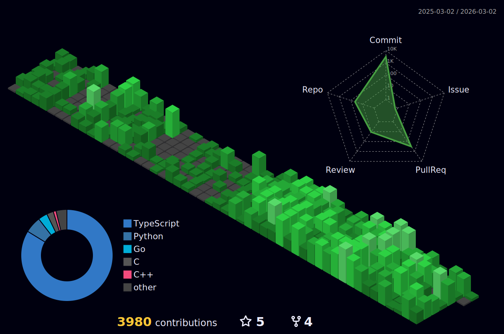

## 💫 About Me

I’m a backend developer passionate about building scalable, efficient, and secure server-side applications.

I'm deeply committed to mastering backend architecture, API security, database design, and real-world system design.

I aim to become a highly skilled backend engineer capable of developing robust systems and contributing to infrastructures.

I’m excited to keep learning, growing, and collaborating with innovative teams that value clean code, performance, and modern engineering best practices.

- 👯 Open to learning, collaboration & backend roles!
- 🌱 Currently expanding my **Postgres** & **NestJS** skills.
- 📫 Reach me at: [shahadathhossensajib732@gmail.com](mailto:shahadathhossensajib732@gmail.com)
- 👨‍💻 Check out my [Portfolio](https://shahadathhs.vercel.app)
- 📄 View my [Resume](https://drive.google.com/file/d/1dtZCEgZyof-qrUreeVpXDlOovosegpuf/view)

## 🌐 Connect with Me

## 💻 Tech & Tool Stack

| Category                 | Technologies |
|--------------------------|--------------|
| **Language**             |   |
| **Backend**              |    |
| **Database**             |    |
| **Version Control & CI/CD** |    |
| **Package Management**   |   |
| **Container**            |  |

## 💼 Experience

### 🚀 Monster Studio (Chattogram, Bangladesh · On-site)

#### Web Developer  
**Nov 2024 – Mar 2025 (5 months)**  
- Contributed to both frontend and backend development in a large-scale **MERN stack** project.
- Built reusable components and REST APIs using **React.js**, **Remix**, **Express.js**, **Node.js**, and **MongoDB**.
- Managed and configured a large-scale **Nx monorepo** for modularity and scalability.
- Led a small frontend team, improving collaboration and productivity.

#### Quality Assurance Intern  
**Aug 2024 – Oct 2024 (3 months)**  
- Wrote unit tests for frontend and backend using **Jest**, **Vitest**, **MSW**, and **Supertest**.
- Used **K6** for backend **load testing** and performance profiling.
- Helped improve code quality and reliability in a full-stack testing setup.

<!-- ## 📊 My Stats -->

<!-- ### 📜 Language and Overview

 -->

## 📈 GitHub Activity Graph

## 🌟 Last Year Stats

