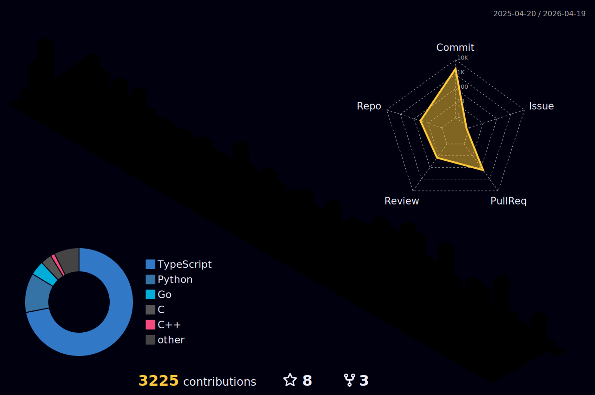

<h2 align="center">

</h2>

<h2>💫 About Me</h2>

I’m a backend developer passionate about building scalable, efficient, and secure server-side applications.

I'm deeply committed to mastering backend architecture, API security, database design, and real-world system design.

I aim to become a highly skilled backend engineer capable of developing robust systems and contributing to infrastructures.

I’m excited to keep learning, growing, and collaborating with innovative teams that value clean code, performance, and modern engineering best practices.

<ul>  
  <li>👯 Open to learning, collaboration & backend roles!</li>
  <li>🌱 Currently expending my <strong>Postgres</strong> & <strong>Nestjs</strong> skills.</li>  
  <li>📫 You can reach me at <a href="mailto:shahadathhossensajib732@gmail.com">shahadathhossensajib732@gmail.com</a></li>  
  <li>👨‍💻 Check out my projects on my <a target="_blank" href="https://shahadathhs.vercel.app">Portfolio</a></li>  
  <li>📄 My <a target="_blank" href="https://drive.google.com/file/d/1dtZCEgZyof-qrUreeVpXDlOovosegpuf/view?usp=drive_link">Resume</a></li>  
</ul>

<h2>🌐 Connect with Me</h2>

  
  
  

<h2>💻 Tech & Tool Stack</h2>

| Category           | Technologies |
|--------------------|--------------|
| **Language**        |  |
| **Backend** |  |
| **Database**        |   |

<h2>💼 Experience</h2>

<h3>🚀 Monster Studio (Chattogram, Bangladesh · On-site)</h3>

<strong>Web Developer</strong> 
<em>🗓️ Nov 2024 – Mar 2025 (5 months)</em>

<ul>
  <li>Contributed to both frontend and backend development in a large-scale <strong>MERN stack</strong> project.</li>
  <li>Built reusable components and REST APIs using <strong>React.js</strong>, <strong>Remix</strong>, <strong>Express.js</strong>, <strong>Node.js</strong>, and <strong>MongoDB</strong>.</li>
  <li>Directly managed and configured a large-scale <strong>Nx monorepo</strong>, optimizing for modularity and scalability.</li>
  <li>Led a small frontend team for several weeks, facilitating collaboration and improving productivity.</li>
</ul>

<strong>Quality Assurance Intern</strong> 
<em>🗓️ Aug 2024 – Oct 2024 (2 months)</em>

<ul>
  <li>Wrote comprehensive <strong>unit tests</strong> for both frontend and backend using <strong>Jest</strong>, <strong>Vitest</strong>, <strong>MSW</strong>, and <strong>Supertest</strong>.</li>
  <li>Explored and experimented with <strong>K6</strong> for backend <strong>load testing</strong> and performance profiling.</li>
  <li>Contributed to improving overall code quality and reliability in a full-stack testing environment.</li>
</ul>

<h2>📊 My Stats</h2> 
<!-- Section 1: Language and Overview Stats -->

  <h3>📜 Language and Overview</h3>
  

<!-- Section 2: GitHub Activity Graph -->

  <h3>📈 GitHub Activity Graph</h3>
  

<!-- Section 3: Last Year Stats -->

  <h3>🌟 Last Year Stats</h3>
  

