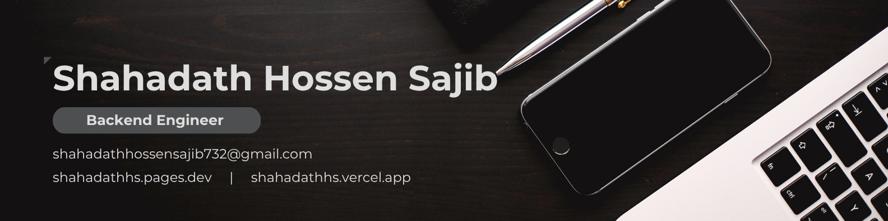

---

## 👋 About Me

**Hey there, I'm Shahadath Hossen Sajib (Sajib)** — Backend Engineer who builds **scalable APIs, distributed systems, and AI-powered backend services** with **Node.js**, **NestJS**, **TypeScript**, and **Python**.

I design high-performance **RESTful APIs**, **real-time applications**, and **event-driven architectures**, and ship them end-to-end — from data modeling through production deployment. Most of my work sits at the intersection of **microservices**, **real-time features**, and **AI integration** (RAG, tool calling, document retrieval).

- 🗄️ **Data layers:** PostgreSQL, MongoDB, Redis — modeled with Prisma, Drizzle, and Mongoose
- ⚡ **Real-time & queues:** Socket.IO, WebRTC, BullMQ for live updates and background workloads
- 🤖 **AI/LLM:** OpenAI API, Ollama, RAG pipelines, and vector search for intelligent features
- 🐳 **DevOps:** Docker, GitHub Actions CI/CD, AWS (EC2 & S3), Nginx, and Caddy on Linux VPS
- 🤝 Open to collaboration on backend-heavy, AI-integrated, or distributed systems work

---

## 📫 Contact

- 📧 Email: **shahadathhossensajib732@gmail.com**
- 📄 Resume: https://drive.google.com/file/d/1dtZCEgZyof-qrUreeVpXDlOovosegpuf/view

---

## 🔗 Connect With Me

I write about backend engineering, system design, DevOps, and real-world project learnings.

---

## 🛠️ Tech Stack

| Category           | Tools & Technologies                                                                                                                                                                                                                                                                                                                                                                                                                                                                                                                            |
| :----------------- | :---------------------------------------------------------------------------------------------------------------------------------------------------------------------------------------------------------------------------------------------------------------------------------------------------------------------------------------------------------------------------------------------------------------------------------------------------------------------------------------------------------------------------------------------- |
| **Languages**      |                                                                                                                                                                                                             |
| **Backend**        |                                                                                                                         |
| **Databases**      |                                                                                                                                                                                                                        |
| **ORM / ODM**      |                                                                                                                                                                                                                            |
| **Messaging & Real-time** |                                                                                                                                                                                                                 |
| **AI & LLM**       |                                                                                                                      |
| **Cloud & DevOps** |                |

---

## 💼 Experience

**Back End Developer — Digital Pylot** _(Feb 2026 – Present)_ · Dhaka, Bangladesh · On-site

- Building a large-scale **CRM & dynamic CMS platform** on a microservices architecture across backend, AI, and deployment
- Shipped a fully customizable CMS (themes, layouts, pages, dynamic content with no code changes) and a **custom RAG chatbot** with tool calling and document retrieval
- Built role-based notifications and dynamic configuration that power complex business workflows
- Run production deployments on **Linux VPS** with Nginx, SSL, and CI/CD across services

**Back End Developer — Softvence Agency** _(Jul 2025 – Feb 2026)_ · Dhaka, Bangladesh · On-site

- Built an **Uber-style logistics platform** — live tracking, dynamic routing, multi-party coordination, and weather-aware routing
- Engineered a **payment engine** for subscriptions, promo codes, and rule-based payouts, plus HR workflows with payroll automation
- Delivered **AI automation** for candidate evaluation, interview generation, and analytics
- Owned PostgreSQL schemas (Prisma/Drizzle) and **AWS EC2 + S3** infrastructure end-to-end

**Web Developer — Monster Studio** _(Aug 2024 – Apr 2025)_ · Chattogram, Bangladesh · On-site

- Contributed across a large monorepo powering **20+ production websites**
- Built an **AI-powered document assistant** with retrieval-based, context-aware responses
- Developed internal tools (custom CMS, creator utilities) with external API integrations
- Led a **frontend team** through code reviews and strengthened reliability with unit tests

---

## 📊 Stats & Activity

<!--  -->

---

  

---

  
  
  
  
  

