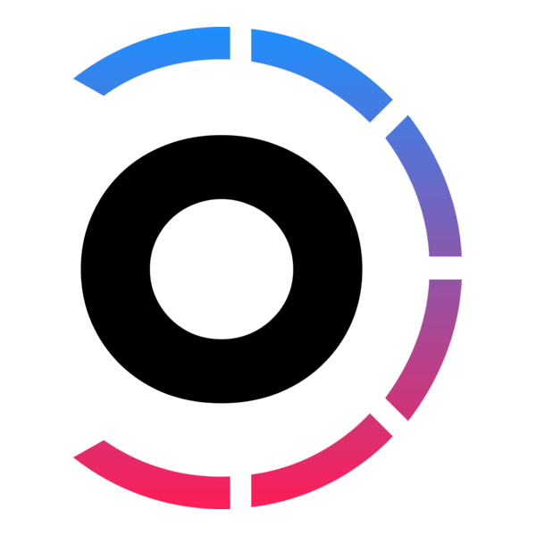
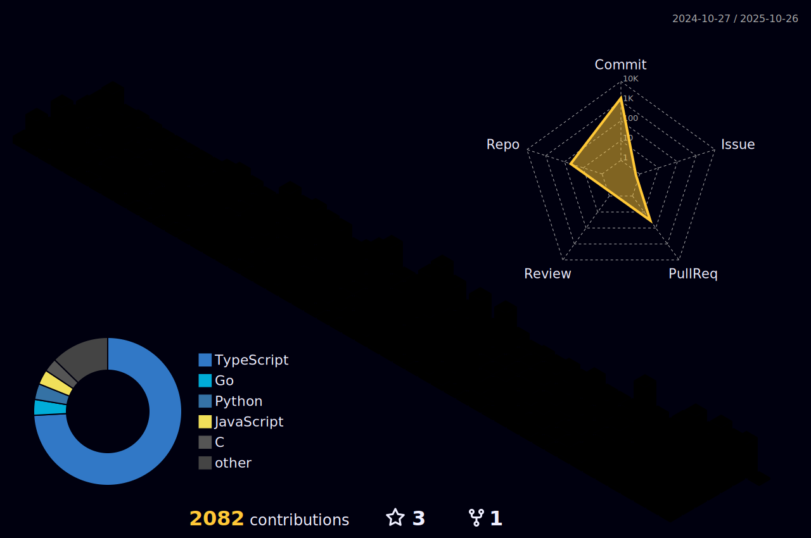

 
<h2 align="center">

</h2>

<h2>💫 About Me</h2> 

I’m a backend developer passionate about building scalable, efficient, and secure server-side applications.

I’m deeply focused on mastering backend architecture, database design, API security, and real-world system design.

I aim to become a highly skilled backend engineer, capable of building robust, scalable systems and contributing to complex backend infrastructures.

I’m excited to learn, grow, and collaborate with innovative teams that value clean code, scalability, and strong engineering practices.

<ul>  
  <li>👯 Open to learning, collaboration & backend roles!</li>
  <li>🌱 Currently learning <strong>Postgres</strong> & <strong>Prisma</strong> to expand my database skills.</li>  
  <li>📫 You can reach me at <a href="mailto:shahadathhossensajib732@gmail.com">shahadathhossensajib732@gmail.com</a></li>  
  <li>👨‍💻 Check out my projects on my <a target="_blank" href="https://shahadathhs.vercel.app">Portfolio</a></li>  
  <li>📄 My <a target="_blank" href="https://drive.google.com/file/d/1dtZCEgZyof-qrUreeVpXDlOovosegpuf/view?usp=drive_link">Resume</a></li>  
</ul>

<h2>🌐 Connect with Me</h2>

  
  
  

<h2>💻 Tech & Tool Stack</h2>

  <!-- Language Section -->
  <h3>Language</h3>
  

    
  

  
  <!-- Backend Section -->
  <h3>Backend & Testing</h3>
  

    
  

  <!-- Database -->
  <h3>Database</h3>
  

    
    
  

  
 <!-- Tools -->
  <h3>Tools</h3>
  

    
  

  
  <!-- Monorepo Tools -->
  <h3>Monorepo Tools</h3>
  

    
    
  

<h2>💼 Experience</h2>

<h3>🚀 Monster Studio (Chattogram, Bangladesh · On-site)</h3>

<strong>Web Developer</strong> 
<em>🗓️ Nov 2024 – Mar 2025 (5 months)</em>

<ul>
  <li>Contributed to both frontend and backend development in a large-scale <strong>MERN stack</strong> project.</li>
  <li>Built reusable components and REST APIs using <strong>React.js</strong>, <strong>Remix</strong>, <strong>Express.js</strong>, <strong>Node.js</strong>, and <strong>MongoDB</strong>.</li>
  <li>Directly managed and configured a large-scale <strong>Nx monorepo</strong>, optimizing for modularity and scalability.</li>
  <li>Led a small frontend team for several weeks, facilitating collaboration and improving productivity.</li>
</ul>

<strong>Quality Assurance Intern</strong> 
<em>🗓️ Sep 2024 – Oct 2024 (2 months)</em>

<ul>
  <li>Wrote comprehensive <strong>unit tests</strong> for both frontend and backend using <strong>Jest</strong>, <strong>Vitest</strong>, <strong>MSW</strong>, and <strong>Supertest</strong>.</li>
  <li>Explored and experimented with <strong>K6</strong> for backend <strong>load testing</strong> and performance profiling.</li>
  <li>Contributed to improving overall code quality and reliability in a full-stack testing environment.</li>
</ul>

<strong>Trainee Frontend Developer</strong> 
<em>🗓️ Aug 2024 (1 month)</em>

<ul>
  <li>Gained practical experience with <strong>React.js</strong>, <strong>Tailwind CSS</strong>, and modern frontend workflows.</li>
  <li>Participated in UI implementation, responsive design, and component architecture basics.</li>
</ul>

<h2>📊 My Stats</h2> 
<!-- Section 1: Language and Overview Stats -->

  <h3>📜 Language and Overview</h3>
  

<!-- Section 2: GitHub Activity Graph -->

  <h3>📈 GitHub Activity Graph</h3>
  

<!-- Section 3: Last Year Stats -->

  <h3>🌟 Last Year Stats</h3>
  

